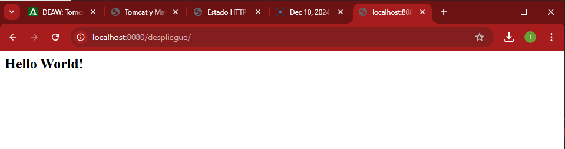
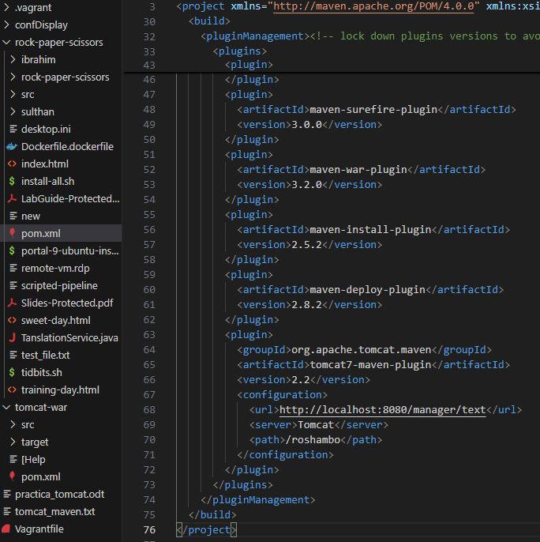

# Práctica tomcat y maven

## Introducción
En esta práctica, instalamos y configuramos un servidor Tomcat 9 en una máquina virtual con Debian 11. También aprendimos a desplegar aplicaciones Java de forma manual y automática utilizando Maven.

## Instalación de Tomcat
1. Instalamos OpenJDK 11 para ejecutar aplicaciones Java.
2. Configuramos e instalamos Tomcat 9 mediante el gestor de paquetes apt.
3. Configuramos los usuarios y permisos necesarios en el archivo tomcat-users.xml.
4. Iniciamos y verificamos el servicio Tomcat, asegurándonos de que funciona en http://localhost:8080.

## Despliegue de Aplicaciones
### Despliegue Manual
Subimos un archivo .war mediante la interfaz gráfica de administración de Tomcat. Esto permitió desplegar la aplicación y verificar que funciona correctamente.

</img>

### Despliegue Automático con Maven
1. Instalamos y configuramos Maven en el sistema.
2. Creamos un proyecto web simple utilizando Maven.
3. Configuramos el archivo pom.xml para permitir el despliegue directo en Tomcat.
4. Usamos comandos de Maven como mvn tomcat7:deploy para desplegar la aplicación automáticamente.

</img>

</img>

## Conclusión
Esta práctica permitió familiarizarnos con la instalación y configuración de un servidor Tomcat, así como con diferentes métodos de despliegue de aplicaciones. Ambos métodos se verificaron con éxito.

